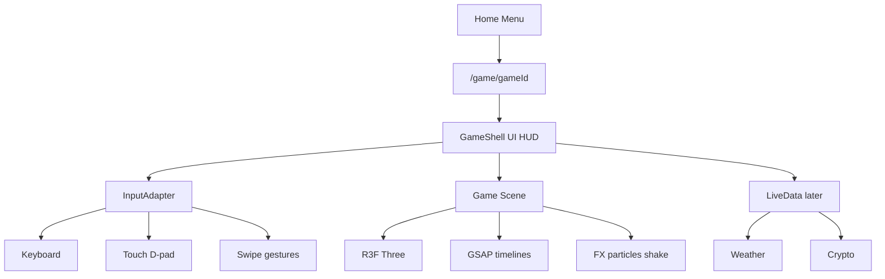
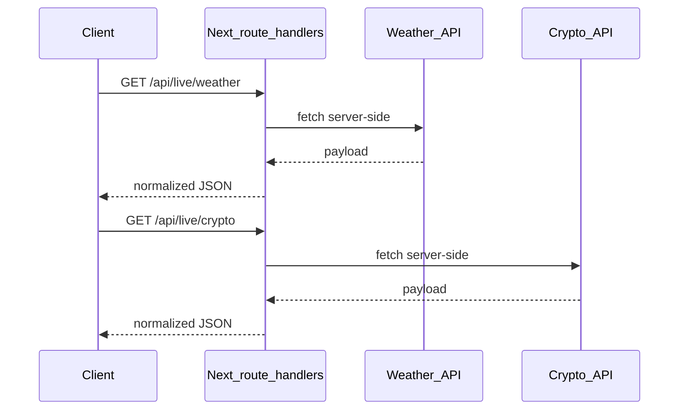

# System Design — 1880 Game Net

Design contract for upgrading the existing **3-game** collection. **Phase 1 focuses on Road Crossing.** Chess and Tic Tac Toe are outlined for later. Live crypto/weather APIs are a future stub only.

---

## 1. Vision

A Next.js hub of stylized 3D mini-games that feel polished on desktop and mobile: readable Crossy-style silhouettes, GSAP juice, and a shared shell so every game opens the same way.

| Game | Status today | Upgrade priority |
|------|----------------|------------------|
| Road Crossing | Playable (R3F) | **Phase 1** |
| Chess | Playable (imperative Three.js) | Phase 2 |
| Tic Tac Toe | Playable (imperative Three.js) | Phase 3 |

No fourth game in this design.

---

## 2. Current state

### Stack

- **Next.js 14** App Router, React 18, TypeScript (mixed with JS)
- **three** + **@react-three/fiber** + **@react-three/drei** (Road Crossing)
- Chess / XO: imperative Three.js + `OrbitControls`
- Themes / characters: module managers (`themeManager.js`, `characterManager.js`)
- Persistence: `localStorage` for custom photo characters only
- **No GSAP**, no physics engine, no external APIs

### Routing

| Route | Role |
|-------|------|
| `/` | Game menu ([`app/page.tsx`](app/page.tsx)) |
| `/game/[gameId]` | Loads `roadCrossing` \| `chess` \| `xo` ([`app/game/[gameId]/page.tsx`](app/game/[gameId]/page.tsx)) |

Registry: [`src/games.js`](src/games.js).

### Road Crossing today

- Shell: [`src/components/RoadCrossingGame.tsx`](src/components/RoadCrossingGame.tsx)
- Scene loop: [`src/road-crossing/RoadCrossingScene.tsx`](src/road-crossing/RoadCrossingScene.tsx) (`useFrame`, lerp hop, AABB collision)
- Lighting: color-only themes via [`GameLighting.tsx`](src/road-crossing/components/GameLighting.tsx)
- Controls: keyboard + DOM pad (`#controls`) via [`useGameControls.ts`](src/hooks/useGameControls.ts) — pad exists but is not a full mobile product (layout, touch, safe areas, perf)

### Legacy

Root `index.html` + `src/main.js` / `src/gameRoadCrossing.js` are an old Vite path. **Do not expand.** Next.js is the only supported runtime.

### Gaps for Phase 1

- No GSAP choreography (hop, shake, game-over, modals)
- Flat look: little fog/sky/env, boxy props, theme = palette swap
- Mobile: D-pad CSS only; no swipe, safe-area HUD, or mobile render budget
- Dual Vite/Next trees create confusion

---

## 3. Target architecture



### Shared principles

1. **GameShell** — back button, score/HUD, theme/character modals, restart overlay. Template: `RoadCrossingGame.tsx`.
2. **R3F-first** for upgraded 3D; Chess/XO migrate in Phases 2–3.
3. **GSAP + `@gsap/react` (`useGSAP`)** for hops, camera punches, UI; keep **`useFrame`** for continuous vehicle motion and camera follow.
4. **AABB collision** stays for Road Crossing (no Rapier/Cannon in Phase 1).
5. **InputAdapter** — one queue (`queueMove`) fed by keyboard, on-screen pad, and swipe; same validation path.
6. **Mobile-first shell** — every Phase 1 UI decision assumes phone portrait + desktop.
7. Deprecate legacy Vite; document only, do not wire new features into it.

---

## 4. Phase 1 — Road Crossing upgrade

Same rules and Crossy feel; better motion, lighting, and **first-class mobile**.

### 4.1 Motion / juice (GSAP)

| Event | Behavior |
|-------|----------|
| Hop | Squash-stretch on takeoff/land |
| Move | Light camera punch |
| Hit | Stronger shake + brief freeze |
| Game over | Timeline: freeze → slam → overlay |
| Modals / menu | DOM enter/exit via GSAP |

Continuous systems (vehicles, follow cam) stay on `useFrame`. Choreographed beats use GSAP timelines under `src/road-crossing/motion/`.

### 4.2 Visual realism (stylized, not photoreal)

- Fog + sky gradient / drei `Environment`
- Soft contact shadows; tuned shadow bias / map size
- Vehicle headlights / taillights; land dust or simple exhaust particles
- `MeshStandardMaterial` with light roughness/metalness variation; keep readable silhouettes
- Themes: color palettes **plus** lighting presets (`day` / `dusk` / `night`)

### 4.3 Feel / gameplay polish

- Tune hop timing in [`src/road-crossing/constants.ts`](src/road-crossing/constants.ts) (`MOVE_STEP_TIME`, etc.)
- Hit flash / freeze frames without changing AABB
- Score pop / combo text via GSAP (optional but designed in)

### 4.4 Mobile version (Phase 1 requirement)

Road Crossing must play well on phones without a keyboard.

**Layout & chrome**

- Viewport meta already in [`app/layout.tsx`](app/layout.tsx); lock usable `viewport-fit=cover` and `safe-area-inset-*` for notched devices
- HUD (back, theme, character, score) sized for thumb reach; avoid overlapping the D-pad
- Full-bleed canvas; prevent browser scroll/zoom while playing (`touch-action: none` on game shell)
- Portrait-primary; landscape supported with D-pad repositioned to a corner cluster

**Controls**

| Input | Behavior |
|-------|----------|
| On-screen D-pad | Keep `#controls`; enlarge hit targets (min ~44px); `pointer`/`touch` events, not only `click` |
| Swipe | Optional: swipe up/down/left/right → same `queueMove` directions; ignore tiny noise |
| Keyboard | Unchanged on desktop |

Refactor [`useGameControls.ts`](src/hooks/useGameControls.ts) into a small InputAdapter so pad/swipe/keyboard all call the same queue. Prefer React handlers over `getElementById` where practical.

**Rendering / perf on mobile**

- Adaptive pixel ratio (`Math.min(devicePixelRatio, 1.5)` or lower on weak GPUs)
- Softer shadow maps on mobile (e.g. 1024 vs 2048)
- Skip or simplify postprocessing / heavy particles on low-end
- `gsap.matchMedia()` / reduced-motion: shorter or disabled juice when `prefers-reduced-motion: reduce`

**PWA-ready notes (design only for Phase 1)**

- Responsive shell and touch controls are in scope
- Installable PWA / service worker can wait for a later polish pass; call out in README when added

### 4.5 Code structure target

```
src/road-crossing/
  RoadCrossingScene.tsx
  GameContext.tsx
  collision.ts
  constants.ts
  generateRows.ts
  validation.ts
  types.ts
  components/          # map, vehicles, player, lighting
  motion/              # GSAP helpers, hop/camera/game-over timelines
  fx/                  # particles, screen shake
  input/               # InputAdapter: keyboard, pad, swipe (new)
```

Shell stays in `src/components/RoadCrossingGame.tsx` (or thin GameShell extract later).

### 4.6 New dependencies

| Package | Role |
|---------|------|
| `gsap` | Tweens / timelines |
| `@gsap/react` | `useGSAP` + cleanup |

Later (only if perf allows): `@react-three/postprocessing` for subtle bloom — desktop-first, gated on mobile.

### 4.7 Out of Phase 1

- Crypto / weather wiring
- GLTF / rigged characters (photo cube stays; **Phase 1.5**)
- Rapier / Cannon
- Full PWA packaging
- Chess / XO deep upgrades

---

## 5. Later phases

### Phase 2 — Chess

- Migrate to R3F board
- GSAP piece moves / captures
- Complete rules: castling, en passant, promotion, stalemate
- Soft local AI
- Mobile: tap-to-select / tap-to-move; larger hit targets on squares

### Phase 3 — Tic Tac Toe

- R3F board + GSAP win-line
- Simple AI opponent
- Mobile: large cell tap targets

### Phase 4 — Live APIs (stub)



- Proxy through Next.js route handlers (hide keys, CORS, rate limits)
- First use: atmosphere (sky/fog from weather; ticker HUD from crypto)
- Optional later: light gameplay modifiers (e.g. night traffic speed)
- Not required for Road Crossing Phase 1 ship criteria

---

## 6. Tech stack (target)

| Layer | Choice |
|-------|--------|
| App | Next.js 14 App Router |
| UI | React 18 |
| 3D | three, R3F, drei |
| Motion | GSAP + `@gsap/react` |
| Collision (Road) | Existing AABB |
| State | React state + context; module managers for theme/character |
| Mobile | Touch pad + swipe, safe areas, adaptive DPR |
| Live data (later) | `app/api/*` proxies |

---

## 7. Implementation order (Road Crossing)

1. Document + deps: add `gsap`, `@gsap/react`
2. **Mobile InputAdapter** — pointer-safe D-pad, swipe, safe-area HUD
3. Motion folder — hop squash/stretch + camera punch
4. FX — hit shake, land dust
5. Lighting / fog / theme lighting presets
6. Game-over + modal GSAP timelines
7. Mobile perf pass — DPR, shadows, reduced motion
8. Cleanup notes for legacy Vite (ignore in builds / README)

Chess → XO → Live APIs follow after Phase 1 feels solid on phone and desktop.

---

## 7b. Phase 1.5 — Chained Crossing (local now, online later)

Inspired by *Chained Together*: **2 players linked by a chain** cross the road together.

### Rules (shipped locally)

| Rule | Behavior |
|------|----------|
| Players | 2 on one device (`local-chain`) |
| Controls | P1 arrows / left-right pad; P2 WASD / second pad |
| Chain | Max **4 tiles** on each axis (row + side); illegal hops blocked |
| Score | Trailing player's row (team must stay together) |
| Fail | Either player **or the chain** hit by a vehicle → both lose |
| Visual | Gold chain links between players; P2 uses partner colors |

### Online future (designed, not built)

- Same rules; `SessionKind = 'online-chain'`
- Room code / invite link; 2 devices, one player each
- Transport: WebSocket (or similar) behind `src/road-crossing/net/`
- `LocalSession` today; `OnlineSession` later implements the same move events
- Cap stays **2 online first** (up to 4 only after 2P is stable)

### Files

- [`src/road-crossing/chain/`](src/road-crossing/chain/) — distance rules + `ChainLink`
- [`src/road-crossing/net/session.ts`](src/road-crossing/net/session.ts) — solo / local-chain / online stub
- Mode toggle in [`RoadCrossingGame.tsx`](src/components/RoadCrossingGame.tsx)

---

## 8. Success criteria (Phase 1)

- Road Crossing remains the same game (infinite rows, hop, avoid vehicles)
- Noticeable juice: hop, hit, game-over feel upgraded via GSAP
- Themes change lighting mood, not only mesh colors
- **Playable on a phone in portrait** with D-pad (and swipe if implemented) without page scroll fighting the canvas
- No crypto/weather required to play
- Design stays aligned with this document; README links here

---

## 9. Related files (quick map)

| Path | Role |
|------|------|
| [`src/games.js`](src/games.js) | Game registry |
| [`src/components/RoadCrossingGame.tsx`](src/components/RoadCrossingGame.tsx) | Shell + Canvas + controls |
| [`src/road-crossing/`](src/road-crossing/) | Scene, map, collision, validation |
| [`src/hooks/useGameControls.ts`](src/hooks/useGameControls.ts) | Current input wiring |
| [`app/globals.css`](app/globals.css) | `#controls`, HUD, menu |
| [`app/layout.tsx`](app/layout.tsx) | Metadata / viewport |
